# Ascend C 自定义算子开发学习总结

## 一、整体学习地图


| 章节            | 主要内容                                   | 关键概念                              |
| ------------- | -------------------------------------- | --------------------------------- |
| 1 Ascend C 简介 | 语言定位、四点突出优势、支持产品型号                     | 兼容 C/C++、自动并行、结构化核函数、CPU/NPU 孪生调试 |
| 2 环境准备        | 驱动固件 + CANN Toolkit 安装、Python/CMake 依赖 | 非昇腾设备可走 CPU 仿真                    |
| 3 快速入门        | HelloWorld、Kernel 直调工程、自定义算子工程         | 入口函数 `__global__ __aicore__`      |
| 4 硬件架构        | 达芬奇架构、计算/存储/控制单元                       | **本章重点**                          |
| 5 编程模型        | SPMD、核函数、硬件抽象、**编程范式**                 | **本章重点**                          |

## 二、 硬件架构：达芬奇（Da Vinci）架构

Ascend C 编写的算子运行在 **AI Core** 上，AI Core 是昇腾处理器的计算核心，每个
AI Core 由三类计算单元 + 存储单元 + 搬运单元 + 控制单元组成。根据 **Cube（矩阵）
和 Vector（向量）单元是否同核部署**，硬件架构分为**耦合架构**和**分离架构**两种。

### 2.0 AI Core 在 SoC 中的位置

AI Core 是昇腾 SoC 上的一块**专用加速核**，与 SoC 上的通用/调度类核并存。整片
SoC 全景如下：

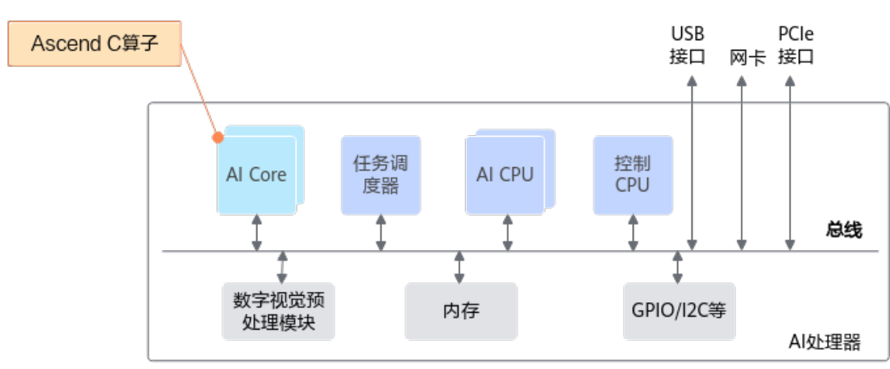

| 单元                  | 角色                                 |
| ------------------- | ---------------------------------- |
| **AI Core**         | 达芬奇架构的专用加速核，运行 Ascend C 算子（后续小节展开） |
| **任务调度器**           | 把算子/任务分派到具体的 AI Core 上             |
| **AI CPU / 控制 CPU** | host–device 协同、流程控制、调度类工作          |
| **数字视觉预处理模块**       | ISP/视觉前处理等 CV 类硬件                  |
| **内存**              | 对外 DDR / 内部存储的统一接口                 |
| **GPIO / I2C 等**    | 低速外设接口                             |

> ⚠️ 区分两个层级：本节下面的小节（2.1/2.2）讲的是 **AI Core 内部**的耦合 vs
> 分离布局，**不要和这张 SoC 总览图搞混**。

下面先给出**达芬奇架构 AI Core 的完整内部结构图**，再分别看耦合与分离两种变体：

### 2.1 达芬奇架构 AI Core 总览（完整内部结构）

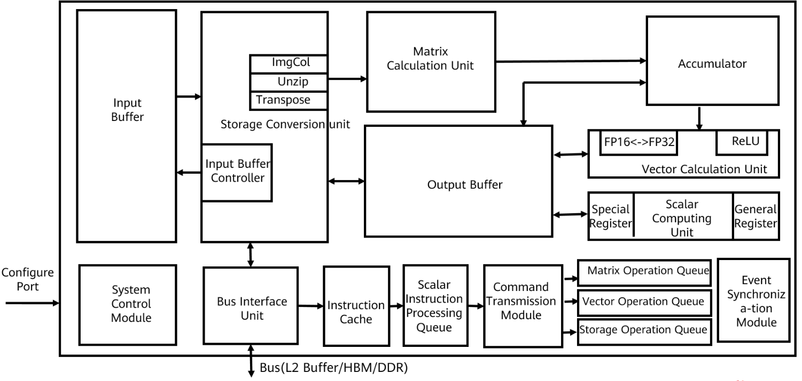

*

| 区域        | 模块                                        | 功能                                |
| --------- | ----------------------------------------- | --------------------------------- |
| **计算单元**  | Matrix Calculation Unit                   | 矩阵（Cube）运算，16×16×N 可扩展            |
|           | Accumulator                               | 累加器，矩阵乘法结果累加                      |
|           | Vector Calculation Unit                   | 向量运算，含 FP16↔FP32、ReLU 等           |
|           | Scalar Computing Unit                     | 标量运算，程序流控制、地址计算                   |
| **存储/搬运** | Input Buffer / Output Buffer              | 输入/输出缓冲                           |
|           | Storage Conversion Unit                   | 格式转换（Img2Col / Transpose / Unzip） |
|           | Input Buffer Controller                   | 缓冲控制器                             |
| **控制单元**  | System Control Module                     | 系统控制                              |
|           | Bus Interface Unit                        | 总线接口（连接 L2 Buffer / HBM / DDR）    |
|           | Instruction Cache                         | 指令缓存                              |
|           | Scalar Instruction Processing Queue       | 标量指令处理队列                          |
|           | Command Transmission Module               | 指令发射模块                            |
|           | Matrix / Vector / Storage Operation Queue | 矩阵/向量/存储 三条运算队列                   |
|           | Event Synchronization Module              | 事件同步模块                            |

### 2.2 耦合架构（Cube 与 Vector 同核）

耦合架构下 Cube 与 Vector 共享同一 AI Core 中的 Scalar、UB、搬运单元，结构如下：

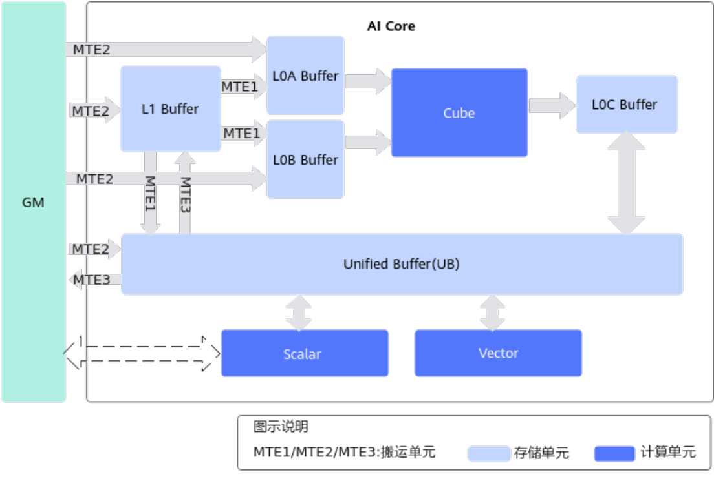

**关键通路：**

- Vector 计算：`GM ↔ UB ↔ Vector ↔ UB ↔ GM`
- Cube 计算：`GM → L1 → L0A/L0B → Cube → L0C → (L1 / GM)`，
  以及 `GM → L1 → UB`（耦合架构独有）
- 注：训练系列产品 **不支持** Scalar 直读 GM；推理系列产品 **支持**。

### 2.3 分离架构（AI Cube + AI Vector 独立核）

A2 系列把一个 AI Core 拆成 **AI Cube（AIC，矩阵核）** 与 **AI Vector（AIV，向量
核）** 两套独立硬件，二者通过 GM 通信：

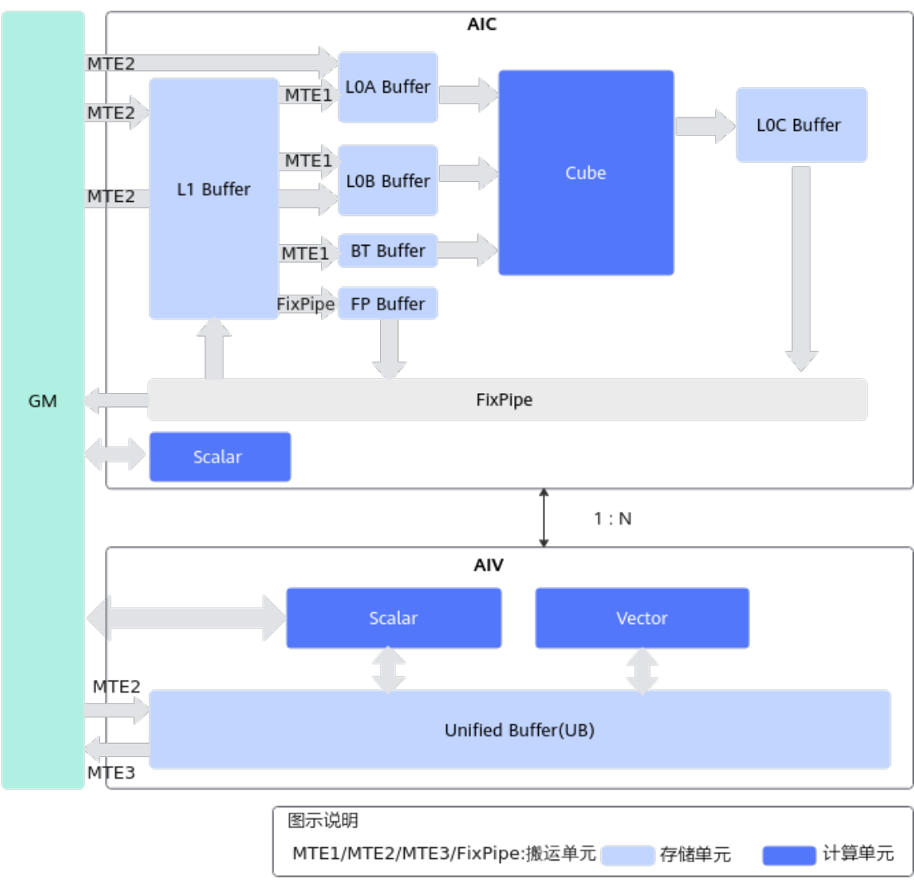

| 子核      | 并行执行单元                          | 内存单元                                          |
| ------- | ------------------------------- | --------------------------------------------- |
| **AIC** | MTE1、MTE2、MTE3、Cube、Scalar（5 个） | GM、L1、L0A、L0B、L0C、**BT Buffer**、**FP Buffer** |
| **AIV** | MTE2、MTE3、Vector、Scalar（4 个）    | GM、UB                                         |

> BT Buffer（BiasTable）存放 Bias，FP Buffer（Fixpipe Buffer）存放量化参数、
> Relu 等参数，由新增的 **FixPipe** 搬运单元负责 L0C→GM/L1 的随路格式/类型转换。

典型数据流：

- Vector：`GM ↔ UB ↔ Vector ↔ UB ↔ GM`
- Cube：`GM → L1 → L0A/L0B → Cube → L0C → FixPipe → GM/L1`

### 2.4 计算单元

| 单元            | 角色                      | 关键点                                           |
| ------------- | ----------------------- | --------------------------------------------- |
| **Scalar 标量** | 流程控制 + 地址/参数计算 + 发射其他指令 | 弱算力，本质是带 ICache/DCache 的小 CPU；尽量减少 if/else    |
| **Vector 向量** | SIMD 风格的向量运算            | 所有源/目的数据都必须在 **UB** 中，且**首地址和长度都 32 Byte 对齐** |

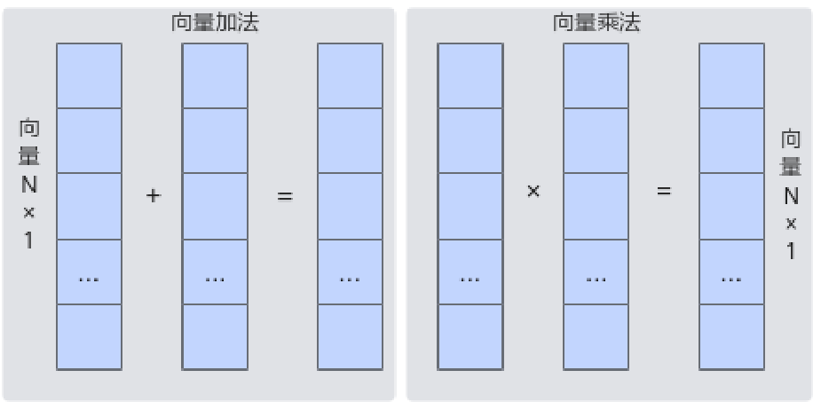

| **Cube 矩阵** | A(M×K) × B(K×N) → C | 输入 L0A/L0B，输出 L0C（累加时也是输入） |

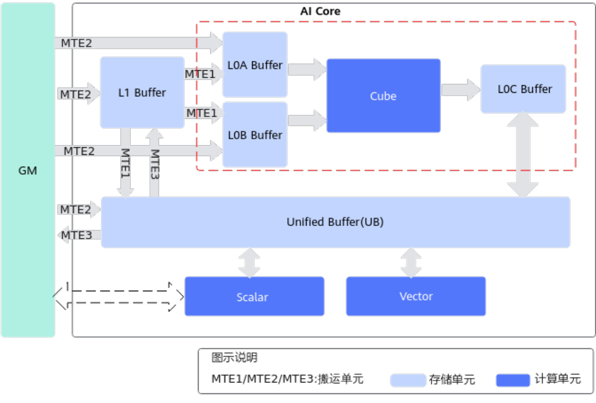

### 2.5 存储单元

| 存储单元                | 作用                           |
| ------------------- | ---------------------------- |
| L1 Buffer           | AI Core 内最大的一块中转区，反复使用的数据可暂存 |
| L0A / L0B Buffer    | Cube 指令输入                    |
| L0C Buffer          | Cube 输出；累加时也是输入              |
| Unified Buffer (UB) | 向量/标量计算的输入输出                 |
| BT Buffer           | Bias（仅分离架构）                  |
| FP Buffer           | 量化、Relu 等参数（仅分离架构）           |

**搬运单元 MTE 负责数据流转，可在搬运中完成随路格式/类型转换：**

| 搬运单元         | 通路                                                       |
| ------------ | -------------------------------------------------------- |
| MTE1         | L1 → L0A/L0B；L1 → UB（仅耦合）；L1 → BT（仅分离）                   |
| MTE2         | GM → {L1, L0A/B}（按分形大小、512B 对齐性能更优）；GM → UB（按 cacheline） |
| MTE3         | UB → GM                                                  |
| FixPipe（仅分离） | L0C → {GM/L1}；L1 → FP Buffer，支持随路转换                      |

> 所有通过 MTE 访问 GM 的数据默认被 L2 Cache 缓存，cacheline 大小
> （128/256/512 Byte）因硬件规格而异。

### 2.6 控制单元与并行流水线

指令从 GM 经总线进入 Instruction Cache 后分两类执行：

- **Scalar 指令**：由 Scalar 单元直接执行；
- **其他指令**：被调度到 5 个独立分类队列（Vector / Cube / MTE1 / MTE2 / MTE3 队列）。

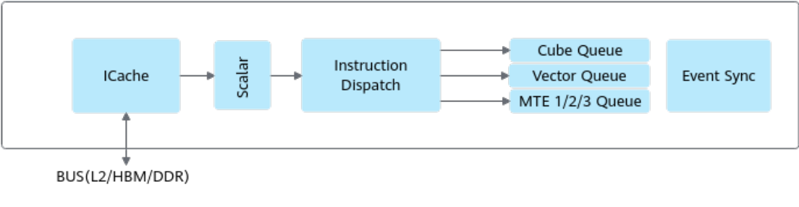

**关键特性：**

- 同一队列内**顺序**执行，不同队列之间**可并行**执行。
- 并行带来的数据依赖通过 **事件同步模块** 控制，提供两种原语：
  - **PipeBarrier**：一条指令，约束**本队列内**前后指令的先后顺序（前序读写完成才能继续）。
  - **SetFlag / WaitFlag**：两条指令，跨队列的"锁"机制，set 等前序读写完成置 1，wait 看到 0 则阻塞、看到 1 则清 0 继续。
- 使用 Ascend C 编程模型（TPipe/TQue/TBuf 等）时这些同步由框架完成，**通常无需手动插**。

---

## 三、 编程模型：从硬件抽象到编程范式

### 3.1 SPMD 并行模型

Ascend C 采用 **SPMD（Single-Program Multiple-Data）**：一份核函数代码在 N 个
AI Core 上同时跑，每个核由 `block_idx` 区分身份，独立处理自己的数据分片。

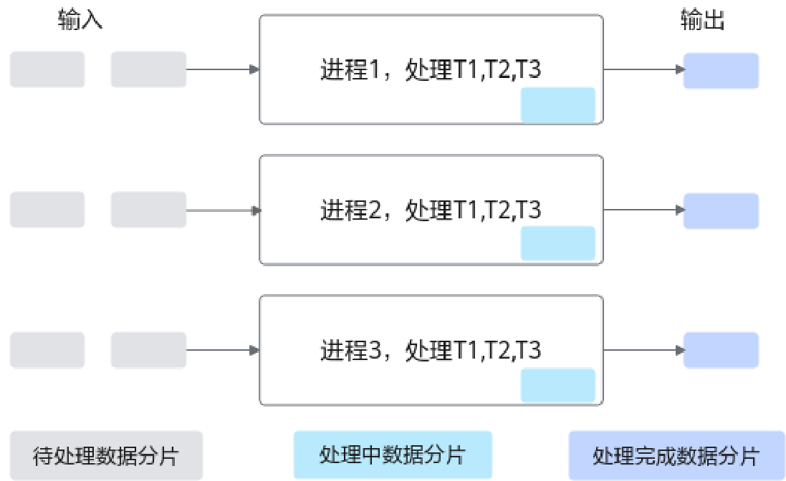

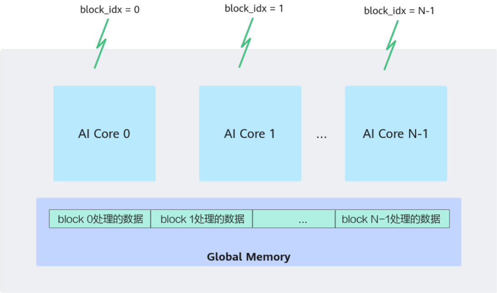

> 上图对应文本里 Add 算子的核心技巧——每个核通过
> `GetBlockIdx() * BLOCK_LENGTH` 偏移量从 GM 取自己的数据。

### 3.2 硬件架构抽象

为了屏蔽不同芯片差异，Ascend C 把硬件抽象成三类核心组件：

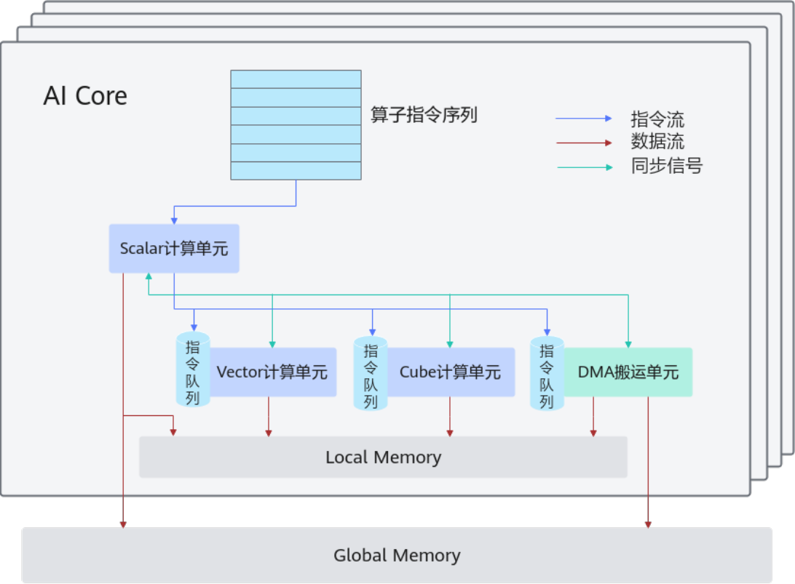

| 抽象组件                             | 物理对应                      |
| -------------------------------- | ------------------------- |
| **Global Memory / GlobalTensor** | 外部存储（GM/HBM）              |
| **Local Memory / LocalTensor**   | 内部存储（UB、L1、L0A、L0B，依芯片而定） |
| **DMA 搬运单元**                     | MTE2（搬入）、MTE3（搬出）等        |
| **Scalar / Vector / Cube**       | 三类计算单元                    |

开发者需要关注三个并行流：**指令流（蓝）→ 同步信号流（绿）→ 数据流（红）**。
Scalar 负责从 GM 读取指令、发射到三类执行单元的指令队列，并向各队列下发同步
指令；Vector/Cube 与 DMA 之间通过同步指令保证数据依赖的正确性。

### 3.3 编程范式总览：流水线并行

AI Core 内部多个执行单元**异步并行**地处理数据，因此 Ascend C 编程范式被设计
成"**流水线式**"：把核内处理分成多个 Stage，Stage 之间通过 **Queue** 通信和
同步，通过 **Pipe（TPipe）** 统一管理内存、事件等资源。

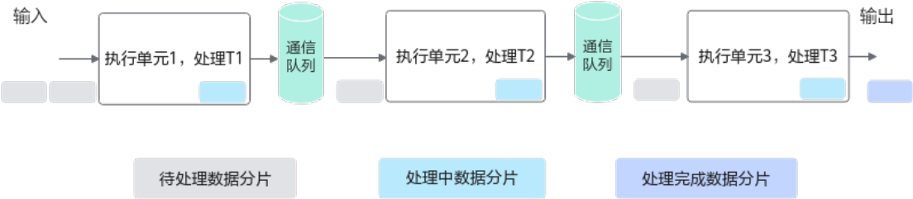

> 类比工业生产线：每个执行单元只完成一道工序，处理完自己的数据后通过通信队列
> 交给下一道工序，从而用并行提升整体吞吐。

### 3.4 Vector 编程范式

Vector 编程范式把算子实现切成 **3 个基本任务**：

1. **CopyIn**：把 GM 上的输入数据搬到 Local Memory（VECIN），完成入队；
2. **Compute**：从 VECIN 出队取数据，在 Vector 单元上做计算，结果入 VECOUT；
3. **CopyOut**：从 VECOUT 出队，把结果搬回 GM。

数据流：`GM → 搬入单元 → UB(VECIN) → 计算单元 → UB(VECOUT) → 搬出单元 → GM`

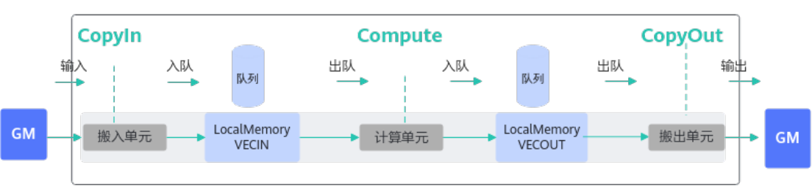


**逻辑位置 TPosition 与物理内存映射：**

| TPosition | 物理内存                   |
| --------- | ---------------------- |
| GM        | Global Memory          |
| VECIN     | Unified Buffer         |
| VECOUT    | Unified Buffer         |
| VECCALC   | Unified Buffer（用作临时变量） |

#### 3.4.1 标准伪代码模板

```cpp
AscendC::TPipe pipe;                                  // 1) 全局资源管理
AscendC::TQue<AscendC::QuePosition::VecIn,  1> queIn;
AscendC::TQue<AscendC::QuePosition::VecOut, 1> queOut;

pipe.InitBuffer(queIn,  2, 1024);                     // 2) 开启 double buffer
for (...) {
    // CopyIn
    auto tensor = queIn.AllocTensor<half>();         // 3) 申请 UB
    AscendC::DataCopy(tensor, gm, len);              // 4) GM -> VECIN
    queIn.EnQue(tensor);                             // 5) 入队

    // Compute
    auto x   = queIn.DeQue<half>();                  // 6) 出队
    auto y   = queOut.AllocTensor<half>();
    AscendC::Add(y, x, x, 1024);                     //    计算
    queIn.FreeTensor(x);
    queOut.EnQue(y);

    // CopyOut
    auto out = queOut.DeQue<half>();
    AscendC::DataCopy(gmOut, out, 1024);             //    VECOUT -> GM
    queOut.FreeTensor(out);
}
```

#### 3.4.2 多数据分片的任务图

待处理数据被切分成 n 片后，**每片都要依次经过 3 个 Stage**，但不同片之间可以
并行，形成"流水任务"：

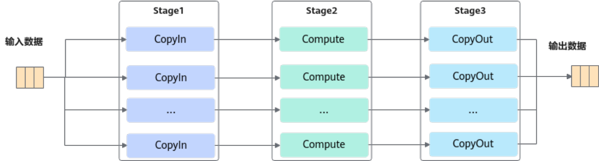

随时间轴展开的执行图（同一片数据在 3 个 Stage 间必须串行，不同片可重叠并行）：

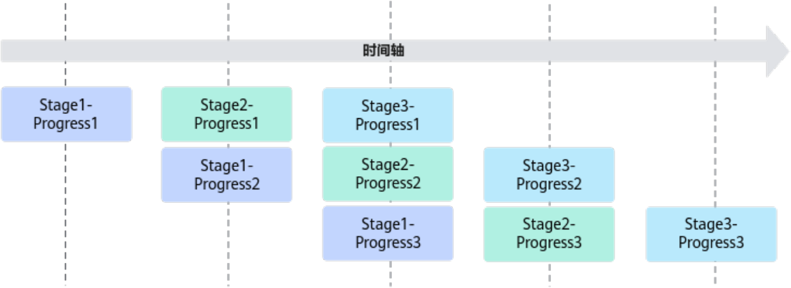

> 这就是 Ascend C 性能调优的"**多片并发 + double buffer**"思路的硬件来源。

#### 3.4.3 内存管理：AllocTensor / FreeTensor 与 Pipe

Vector 范式里的 Queue 内存以及计算用的临时 TBuf，都由 `TPipe` 统一管理：

- `pipe.InitBuffer(queIn, 2, 1024)` → 初始化 Queue 内存（这里的 2 就是 double buffer）；
- `AllocTensor` → 从 Queue 申请一块 LocalTensor；
- `FreeTensor` → 用完归还内存。

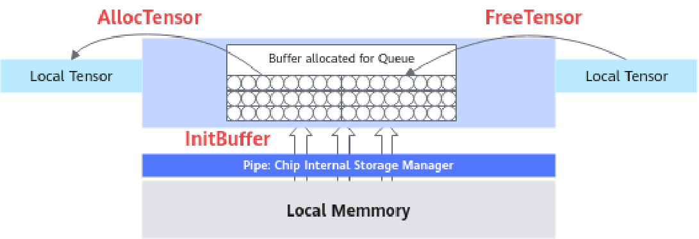

#### 3.4.4 三个 Stage 间的接口 → 硬件同步原语的映射

以 `z = Add(x, y)` 为例，框架会把高层接口**拆解成 16 条指令**，分别下发到 3 个
指令队列（搬入、计算、搬出），并自动插入同步：

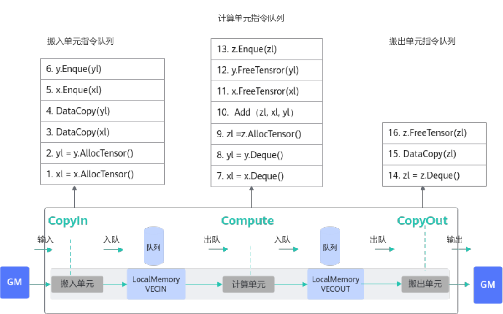

| 同步需求                       | 解决方式                         | 底层原语                                                   |
| -------------------------- | ---------------------------- | ------------------------------------------------------ |
| **写后读**（数据搬入后才能计算、计算后才能搬出） | `EnQue` / `DeQue`            | EnQue 发射 `set` 信号；DeQue 发射 `wait` 信号；wait 阻塞直到 set 完成  |
| **读后写**（内存被读完后才能再写入）       | `AllocTensor` / `FreeTensor` | AllocTensor 发射 `wait` 等待内存可写；FreeTensor 发射 `set` 通知可复用 |

> 也就是说，**AllocTensor/FreeTensor 和 EnQue/DeQue 看似在管内存，本质上是在
> 帮开发者在硬件层面管理 MTE、Vector、MTE3 三个队列之间的同步**。这正是
> "编程范式"和"硬件流水线"合二为一的关键。

### 3.5 Cube 编程范式（衔接）

Cube 范式使用更完整的 TPosition 来表达 A、B、C 矩阵在 L1/L0 之间的流动：

| TPosition                | 物理内存                             |
| ------------------------ | -------------------------------- |
| A1 / B1                  | L1 Buffer（整块 A/B 矩阵，类比 CPU L2）   |
| A2 / B2                  | L0A / L0B（切分后小块，类比 CPU L1）       |
| C1 / C2                  | 训练系列为 UB / L0C；A2 训练系列为 L1 / L0C |
| VECIN / VECCALC / VECOUT | Unified Buffer                   |

### 3.6 融合算子编程范式（Cube + Vector）

当一个算子既要走 Matmul 又要走 Vector 计算时，Ascend C 把它建模成"5 步流水线"：

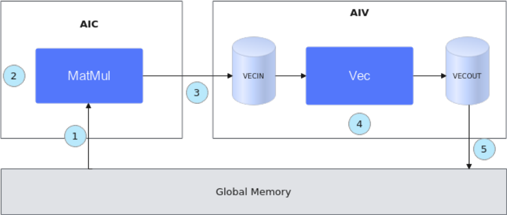

1. 从 GM 初始化 Matmul，把数据搬到 AIC 上；
2. AIC 执行 Matmul；
3. Matmul 的结果通过 GM 搬到 AIV（CO2 → VECIN）；
4. AIV 上做 Vector 计算；
5. Vector 结果写回 GM。

伪代码骨架：

```cpp
template<typename aType, typename bType, typename cType, typename biasType>
__aicore__ inline void MatmulLeakyKernel<...>::Process() {
    // 1) 初始化 MatMul 对象，数据从 GM 搬到 Cube 核
    REGIST_MATMUL_OBJ(&pipe, GetSysWorkSpacePtr(), matmulObj);
    matmulObj.Init(&tiling);
    matmulObj.SetTensorA(aGlobal);
    matmulObj.SetTensorB(bGlobal);
    matmulObj.SetBias(biasGlobal);

    while (matmulObj.template Iterate<true>()) {       // 2) MatMul 计算
        // 3) 将结果搬到 Vector 核
        reluOutLocal = reluOutQueue_.AllocTensor<cType>();
        matmulObj.template GetTensorC<true>(reluOutLocal, false, true);
        // 4) Vector 计算
        AscendC::LeakyRelu(reluOutLocal, reluOutLocal, (cType)alpha,
                           tiling.baseM * tiling.baseN);
        reluOutQueue_.EnQue(reluOutLocal);
        // 5) 写回 GM
        reluOutQueue_.DeQue<cType>();
        AscendC::DataCopy(cGlobal[startOffset], reluOutLocal, copyParam);
        reluOutQueue_.FreeTensor(reluOutLocal);
    }
    matmulObj.End();
}
```

---

## 四、硬件 ↔ 编程范式对照速查

| 硬件事实                                | 编程范式中的体现                                                              |
| ----------------------------------- | --------------------------------------------------------------------- |
| AI Core 多个执行单元（Vector/Cube/MTE）异构并行 | 把算子拆成 CopyIn / Compute / CopyOut 三个 Stage                             |
| 5 个独立指令队列 + 事件同步模块                  | Ascend C 帮你隐藏同步：EnQue/DeQue 解决"写后读"，AllocTensor/FreeTensor 解决"读后写"    |
| UB 容量有限且要求 32 Byte 对齐               | 通过 `TPipe` 集中申请/释放内存，double buffer 复用 UB                              |
| Vector/Cube 同核（耦合）/分核（分离）           | 耦合用 Vector 范式 + 高阶 API；分离有独立的 AIC/AIV 核数规则，融合算子需 5 步流程                |
| 内部多级存储 L1 / L0A / L0B / L0C / UB    | 用 TPosition 抽象（GM / VECIN / VECOUT / A1 / A2 / B1 / B2 / C1 / C2）屏蔽差异 |
| 多个 AI Core 同时跑同一段代码                 | SPMD：`GetBlockIdx() * BLOCK_LENGTH` 偏移拿数据，blockDim 决定启动几个逻辑核          |

---

## 五、个人要点回顾

1. **理解硬件是理解范式的前提**：达芬奇架构里 5 个并行执行队列 + 事件同步
   机制，就是 Vector 编程范式之所以要拆成 CopyIn/Compute/CopyOut 并通过
   Queue 通信的硬件原因。
2. **TPosition 是抽象的"内存层级"**：写代码时把变量放到 VECIN/VECOUT/VECCALC
   等逻辑位置即可，不需要关心具体芯片用的是 UB 还是 L1。
3. **Pipe + Queue 是一对黄金组合**：`TPipe` 负责统一管内存和事件，
   `TQue<TPosition, Depth>` 负责 Stage 之间的数据通信和同步，二者一起实现
   了"多片数据 + 多 Stage 流水线"的并行模式。
4. **同步原语是范式的底层功臣**：EnQue/DeQue（写后读）+ AllocTensor/FreeTensor
   （读后写）在硬件层面对应 set/wait 信号，不用手动插是 Ascend C 简化开发的
   核心优势，但调试性能时仍然需要回到这一层。
5. **性能优化的两条主线**：
   - **多核并行**：增大 blockDim，充分利用物理核（耦合看 AI Core 数，分离按
     Vector/Cube 分别设置）。
   - **核内流水**：开 double buffer、合理切分 tile，让 CopyIn/Compute/CopyOut
     三个 Stage 始终有数据可处理。

> 以上即第 1~48 页的硬件 + 编程范式学习总结，接下来第 6 章会进入具体 API
> （矢量计算、DataCopy、内存管理）的细节。
